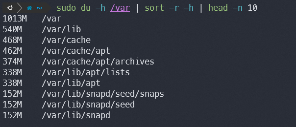
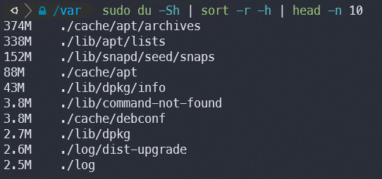
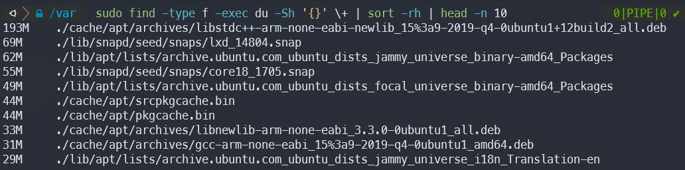

Not everything revolves around automation, cloud and serverless infrastructure. Sometimes you need to get on a server and do things the manual way, that's how one of the projects
I'm currently working on is, everything is just a VM and automation is sparse.

One of the things that happens in there is that some of the applications will just fill out the storage in different mounts from time to time with random logs and reports from
new integrations or services and some of the reports can get as big as 800Mb, automating this kind of housekeeping is doable but it takes time and needs to be approved by the project
owners, but things are slow so I just have to deal with it manually from time to time.

# Using `du`
`du` stands for **d**isk **u**sage and can be used to estimate file space usage, using some tricks we can use this to find out which files or directories are the largest and then clean them up.

## For a specific directory
```bash
du -h /var | sort -r -h | head -n 10
```



### Explained
- `du -h /var` - Will set `/var` as the target and output the sizes in human-readable format (KB, MB, GB)
- `sort -r -h` - Sort the output in reverse and parse human-readable format
- `head -n 10` - Show only first 10 lines

## Simplified relative to the current directory
```bash
du -Sh | sort -r -h | head -n 10
```



I call this "simplified" because of the `-S` flag which will exclude subdirectory sizes from the totals, meaning that it will only list directories that contain large files.
For example notice how `/var/lib` is not present as the second position in the list, that is because of that flag. In the grand scheme of things `/var/lib` is the largest subdirectory
of `/var` if we look at the first example, but as the second example shows, `/var/lib/apt/lists` contains most of that, thus eliminating the guess of where exactly in `/var/lib` we should
look for files to clean up.

## Finding ONLY the largest files
```bash
find -type f -exec du -Sh '{}' \+ | sort -rh | head -n 10
```



- `find -type f -exec du -Sh '{}' \+` - find only files (`-type f`) and execute (`-exec`) `du -Sh` on all of them at once, `{}` is a placeholder for files found and `\+` means that
instead of executing the command on each file found it will execute the command on all at once, something like this `du -Sh file1 file2 file3 ..`

# Enter `ncdu`
Now, using `du` is fine when you mostly know what to look out for, but there is an easier way and that is [ncdu](https://dev.yorhel.nl/ncdu).


`ncdu` is pretty light at only ~600kb, it's available in a bunch of formats, including standalone binaries which makes it easy to just put on a server and have it available instantly.
